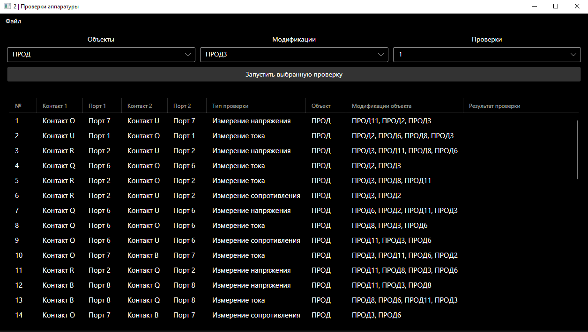

# Тестовое задание по .NET Avalonia UI

Программа для загрузки проверок оборудования и сохранения отчетов о проверках

## Запуск

Для запуска программы введите:

```bash
dotnet run --project TestAssigment
```

Для запуска генератора проектов (аппаратуры с проверками) используется следующая команда с аргументами:

```bash
dotnet run --project ProjectsGenerator -- -p <путь к проектам> -n <количество проектов>
```

## Функционал программы

Программа позволяет просматривать обьекты, записанные в проекте, их модификации и номера проверок, ассоциированные с данными модификациями. Так же позволяет провести проверки объектов, заполнил поле `Результат проверки` случайными числами. После результаты проверок сохраняются в файле `<название объекта>_<модификация объекта>_<номер проверки>.db`, а отчет на основе проверок сохраняется в файле `<название объекта>_<модификация объекта>_<номер проверки>.html`.

Программа написана с использованием MVVM архитектуры: модели расположены в папке [Models](/TestAssigment/Models/), представления в папке [Views](/TestAssigment/Views/), модели представления в папке [ViewModels](/TestAssigment/ViewModels/). Представлением является сам интерфейс программы, моделью являются классы по работе с проектом и проверками, модели представления же связывают модель и представление между собой. Модели представления хранят в себе массивы и значения, который отображаются в представлении и изменяются в модели.

Проект представляет собой папку с двумя файлами: базой данных и `project.json`. В `.json` файле хранится основная информация о проекте: его название и название аппаратуры(пока нигде не используется и совпадает с названием проекта).

Примеры проектов, сгенерированные с помощью программы находятся в папке [ExampleProjects](/ExampleProjects/)

Программа использует [AvaloniaUI](https://github.com/AvaloniaUI/Avalonia) для отображение интерфейса, [FastReports](https://github.com/FastReports/FastReport) для генерации отчета и библиотеку [Microsoft.Data.Sqlite](https://www.nuget.org/packages/microsoft.data.sqlite/) для работы с SQLite.



## Функционал генератора проектов

Генератор проектов создает проекты, со случайным набором проверок. Каждый проект и аппаратура в нем названы по порядковому номеру проекта, начиная с 0. Доступные объекты, их модификации и типы проверок описаны в исходном коде генератора.
